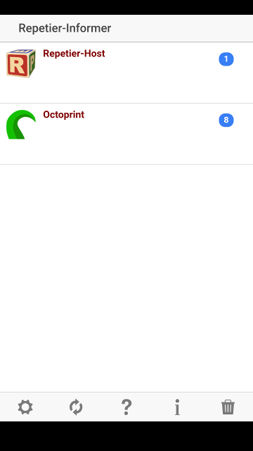

# OctoPrint-RepetierInformer

Recieve push notifications using the paid for Repetier-Informer app for android or apple.
More information can be obtained via the Repetier Apps webpage at https://www.repetier-apps.com.

Repetier has granted use of my own Application ID.
Use of the OctoPrint tenticle logo has been granted by Gina Häußge.

## Known Issues
- Currently does not send detailed errors when a fault occurs.
- Does not trigger the pause notice when M600 triggers a filament change. Not sure about M25 pause modes.
- There is no error reporting on success/failure of the triggered notice to repetier.

## Screenshots

## Setup

Install via the bundled [Plugin Manager](https://github.com/foosel/OctoPrint/wiki/Plugin:-Plugin-Manager)
or manually using this URL:

    https://github.com/drdelaney/OctoPrint-RepetierInformer/archive/master.zip

## Configuration

Set up your Informer-Group within the app first.
Once set up, edit the settings for the plugin and enter the group in, as well as the other optional values.
Change your notification options as required.
